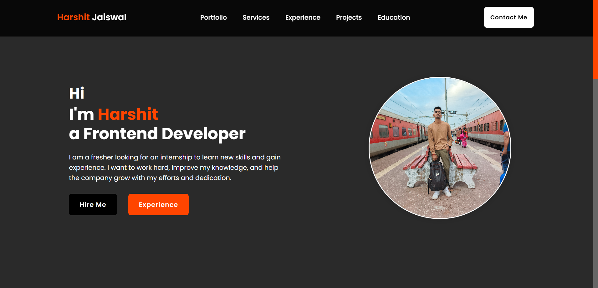

# 💼 Harshit Jaiswal - Frontend Developer Portfolio

Welcome to my personal portfolio website! This project showcases my skills, experiences, and projects as a **Frontend Developer**. The website is built to serve as a digital resume and professional introduction.

## 🖥️ Preview



## 🚀 Features

- **Modern UI** – Clean, minimal, and visually appealing layout.
- **Navigation Bar** – Easy access to Portfolio, Services, Experience, Projects, and Education sections.
- **Call to Action** – Prominent "Hire Me" and "Experience" buttons.
- **About Section** – Introduction with a professional image.
- **Dark Theme** – Stylish dark background with a vibrant highlight color.

## 📁 Sections Included

- **Portfolio**
- **Services**
- **Experience**
- **Projects**
- **Education**
- **Contact Me**

## 🛠️ Tech Stack

- HTML5
- CSS3
- JavaScript (optional)
- Responsive Design with Flexbox/Grid

## 📷 Hero Section Highlight

- Personal greeting with name highlight
- Title: *Frontend Developer*
- Catchy intro text and CTA buttons
- Profile image in a circle frame with background

## 📌 How to Use

1. Clone this repository:
   ```bash
   git clone https://github.com/your-username/portfolio-website.git
